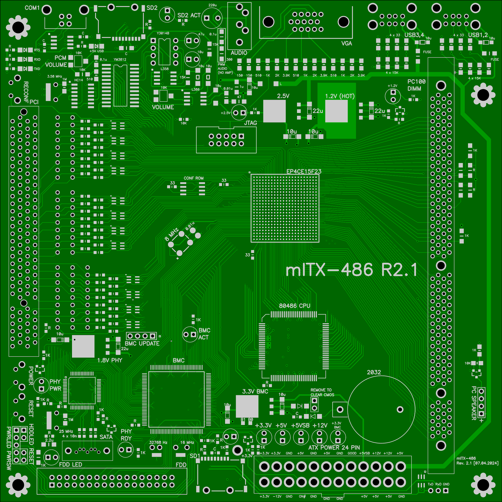

# mITX computer motherboard for 80486 and RISC-V

* Standard mITX 170x170 mm
* 4-layer design with 0.2/0.46 mm vias (no extra charge on most factories)
* 1 x FPGA Altera EP4CE15F23C8
* 1 x PC-100 DIMM up to 512 megabytes
* 1 x 80486 CPU (optional)
* 1 x USB UART
* 1 x VGA
* 4 x USB
* 1 x PCI
* 1 x SATA
* 2 x SD-card
* 1 x FDD
* 1 x Yamaha YM3814 synthesizer (AdLib)
* 1 x PWM audio
* Standard ATX power supply

This board was originally designed to work with Texas Instruments / Cyrix 486 CPU. Now it is optional.

"mitx2.lay6" is a Sprint Layout 6 design file.

Tested with:
* 128 MB (PC-100) and 256 MB (PC-133) (noname) DIMMs taken from old IBM PCs.
* 120 GB ADATA, 240 GB WD SSDs (via BMC, SATA is working good!).
* 16/32 GB Smartbuy, 64 GB Samsung EVO SD-cards.

Work is in progress. My goal is to build RISC-V Linux system.

### BMC

Baseboard management controller (BMC) is optional and is used to:
* Control power/reset buttons and turn on/off ATX power supply.
* Expand FPGA pins to allow connection of SATA HDD, second SD-card, and FDD interfaces.
* Keep and provide realtime clock (RTC) data to FPGA.
* Act as a BIOS ROM for 486 CPU (up to 384 KB for "E" version of stm32).
* Control the Yamaha synthesizer.
* Take care of IBM PC peripherials in 486 mode to simplify FPGA design.

If you don't want to use BMC connect "power" button directly to power supply's "PSON" signal.

### Top view

# Bottom view

