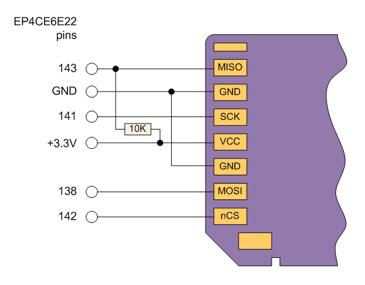
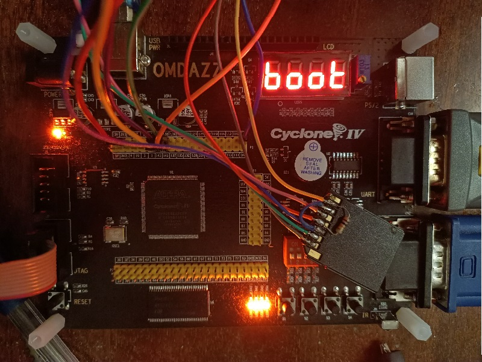

# RISC-V for OMDAZZ board

A very simple RISC-V (32 bit, IM) CPU for OMDAZZ board. Able to run Linux.

Execution time:
* Most instructions in 4 cycles (+ROM delay).
* Shifts in 5..9 cycles.
* Div/Rem in 38 cycles.
* Load in 6 cycles (+ROM/RAM/device delay).
* Store in 7 cycles (+RAM/device delay).

Peripherial devices:
* Onboard SDRAM (8 MBytes)
* Video display controller (VGA 640 x 480 @ 60 Hz, 8 colors)
* UART
* SPI
* Upcounting timer
* Buttons, LEDs, 7-segment display

## Running Linux

The OMDAZZ board have only 8 megabytes of SDRAM so the Busybox program will not work properly. Only small demo programs can be run by OS.

* Connect SD-card adapter as shown on a picture below.
* Format a new SD-card with MBR partition table and FAT32 file system.
* From "linux" directory copy "Image" and "fdt" files to SD-card's root directory.
* Insert SD-card and connect RS232 cable.
* Compile the project and configure FPGA.
* Compile and run "demos/sdcard_boot" program. The "sdcard_boot" program will load devicetree and kernel files to SDRAM and then launch Linux kernel.

To build your own Linux kernel use ".config" file from linux directory. Minimal hvc driver (drivers/tty/hvc) is also provided.
It is used instead of standard 8250 to speedup boot process a little and save a few kilobytes.

If you want to test the same Linux kernel with 16 or more megabytes of RAM right in your browser please check out "riscv-omdazz-emul" project.

## Building / testing on a Windows machine

* Please use Quartus 13.0 (or later).
* To compile C examples please use riscv64-unknown-elf- toolchain. The toolchain's BIN directory should be added to PATH. If you don't want to edit your PATH add full path to toolchain's executables in "compile.bat" files.
* The "run.bat" script will do anything for you.

### bin2mif

The "bin2mif" tool's repo: https://github.com/b-dmitry1/bin2mif

Please compile it manually using Visual C++ (on a Windows machine) or GCC (on a Linux machine) and copy to this directory.

### Testing

A small collection of sample programs could be found in a "games" and "demos" directories.

The CPU is configured to run at 50 Mhz.

Memory map:
* 0x00000000 - 0x00002FFF ROM (12 kbytes)
* 0x00003000 - 0x00003FFF RAM (4 kbytes)
* 0x10000000 - 0x10000007 UART
* 0x11004000 - 0x1100BFFF Timer
* 0x12000000 - 0x12000003 VDU regs
* 0x13000000 - 0x13000003 GPIO
* 0x14000000 - 0x14000003 7-segment display
* 0x15000000 - 0x15000003 SPI
* 0x80000000 - 0x807FFFFF SDRAM (8 mbytes)

Please don't use standard "printf", "scanf", or other heavy functions. They need 64K+ ROM.

### SDRAM controller

By default the SDRAM controller is configured to work with 8 MByte 16-bit SDRAM. If you want more memory (32 or 64 megabytes)
replace the SDRAM IC and set "ras_bits" and "cas_bits" parameters in sdram.v file as defined in a datasheet.
For a common 16-bit 32 MByte SDRAM the values should be: ras_bits = 13 and cas_bits = 9. Unfortunatelly there is no A12 line
on the board so you'll need to connect it manually to any free pin of FPGA.

### Video controller

The displayed video window (framebuffer) may reside anywhere in a SDRAM. To place a window where you want it to be just program
the 8-byte aligned address to a "vram_start" register located at 0x12000000 (write only).

A smooth hardware vertical scrolling can be achieved by adding +/- 320 bytes to a "vram_start" register.

The video mode is 640 x 480 pixels with 8 displayed colors packed in a 4-bit values. Each byte of a video memory contains 2 pixels so
the screen size is 640 x 480 x 4 bit = 153600 bytes. The stride is 320 bytes.

### SD-card connection

Full-to-micro SD-card adapter shipped with a card can be connected directly using short wires and 10K resistor.

